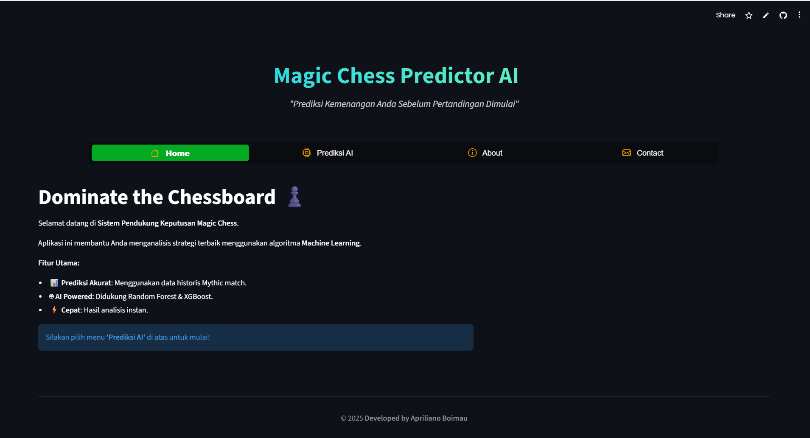

# 🏆 Magic Chess Prediction Simulator (MCGG S4)

[](https://mcggpredictor-nyknw.streamlit.app/)
[](https://www.python.org/)
[](https://scikit-learn.org/)
[](https://pandas.pydata.org/)
[](https://numpy.org/)
[](https://git-scm.com/)

> **Sistem Prediksi Probabilitas Kemenangan Magic Chess Berbasis Machine Learning.**

Aplikasi ini dikembangkan untuk memprediksi peluang kemenangan (Win Rate) user dalam game **Magic Chess** berdasarkan kombinasi _Commander_, _Role_, dan _Faction_ yang digunakan. Proyek ini menggunakan algoritma Machine Learning yang telah dilatih dengan data historis pertandingan.

🔗 **Link Aplikasi Live:** [Klik Disini](https://mcggpredictor-nyknw.streamlit.app/)

---

## 🖼️ Tampilan Aplikasi


_(Gambar di atas adalah tampilan antarmuka aplikasi saat dijalankan)_

---

## 🚀 Fitur Unggulan

- **🕵️ Commander & Gogo Analysis**: Mendukung input Commander utama dan pemilihan skill Gogo Commander.
- **🧮 Smart Synergy Calculator**:
  - Validasi otomatis tier sinergi (misal: Sinergi Mage level 1, 2, dst).
  - Peringatan otomatis jika input user belum mencapai batas minimum aktif (Tier Warning).
- **📊 Real-time Prediction**: Menghitung persentase "Potensi Menang" vs "Berisiko Kalah" secara instan.
- **🎨 Interactive UI**: Tampilan modern dengan animasi Lottie dan validasi visual (Hijau/Merah).

---

## 🛠️ Teknologi

- **Bahasa Pemrograman**: Python
- **Framework Web**: [Streamlit](https://streamlit.io/)
- **Machine Learning**: Scikit-Learn (Random Forest / Classifier)
- **Data Processing**: Pandas, NumPy
- **Persistence**: Joblib (untuk load model `.pkl`)

---

## 💻 Instalasi Lokal

Jika ingin menjalankan proyek ini di komputer Anda sendiri:

1.  **Clone Repository**

    ```bash
    git clone [https://github.com/2eight9/mcggs4_p1.git](https://github.com/2eight9/mcggs4_p1.git)
    cd mcggs4_p1
    ```

2.  **Install Dependencies**

    ```bash
    pip install -r requirements.txt
    ```

3.  **Jalankan Aplikasi**
    ```bash
    streamlit run app.py
    ```

---

## 📂 Struktur Folder

```text
mcggs4_p1/
├── 📄 app.py                  # File utama aplikasi (Entry point)
├── 📄 utils.py                # Fungsi logika (Tier logic, load model, CSS)
├── 📂 views/
│   └── 📄 prediction.py       # Tampilan halaman prediksi & input user
├── 📂 images/                 # Aset gambar Commander
├── 📄 requirements.txt        # Daftar library yang dibutuhkan
├── 📄 screenshot.png          # Preview tampilan aplikasi
└── 📄 *.pkl files             # Model ML & Encoder yang sudah dilatih
```
